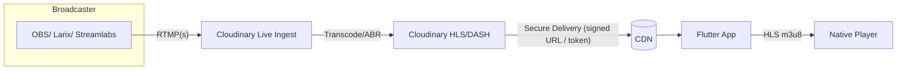

# Viabilidad técnica: Cloudinary Live Streams en gallos_app_new

Este documento valida si la app actual (Flutter) puede usar Cloudinary para transmisiones en vivo (Live Streams) y define una arquitectura de referencia, dependencias, flujos y riesgos.

Fecha: 2025-09-22
Estado: Propuesta viable

## Contexto actual del proyecto
- Reproductor actual: `WebView` en `lib/features/transmisiones/screens/transmision_en_vivo_screen.dart` que carga `evento['url_transmision']`.
- UI: ya existe pantalla con controles de fullscreen, overlay “EN VIVO” y manejo básico de errores/carga.
- Dependencia existente: app ya usa Cloudinary para media (imágenes/videos bajo demanda).

## ¿Es viable usar Cloudinary para Live Streams?
Sí, es viable. Cloudinary ofrece Live Streaming con:
- Ingesta RTMP(s) desde codificadores (OBS, Larix, Streamlabs, etc.).
- Entrega HLS/DASH (incl. Low-Latency HLS como opción avanzada).
- Firmado/expiración de URLs (auth), tokenization y control de acceso a nivel de delivery.
- Transcodificación/ABR y reproductibilidad en dispositivos móviles.

Para Flutter, la reproducción HLS se integra fácilmente con:
- `video_player` (oficial) o `better_player` (controles avanzados) para `m3u8`.
- Alternativamente WebView puede embeber un player web (p. ej. Cloudinary Player), pero nativo tiene mejor UX.

## Arquitectura propuesta



- Backoffice/Admin:
  - Crear “stream” (vía API) para obtener `rtmp_url` + `stream_key`.
  - Generar URL de reproducción HLS (`.m3u8`) con o sin firma.
  - Distribuir credenciales de emisión al organizador.

- App Flutter:
  - Consumir el `m3u8` del evento desde API backend (tu Railway) en lugar de un `iframe`.
  - Reproducir con `video_player`/`better_player`.

## Flujos principales
- Alta de evento:
  1) Backend solicita a Cloudinary crear un live stream (API REST).
  2) Guarda `ingest.rtmp_url` + `stream_key` y `playback.hls_url`.
  3) En la app admin/organizador se muestran credenciales para OBS/Larix.

- Emisión:
  1) Organizador abre OBS/Larix y emite a `rtmp_url` + `stream_key`.
  2) Cloudinary transcodifica y publica HLS.

- Reproducción:
  1) App consulta `GET /eventos/{id}` y recibe `hls_url` protegido.
  2) App reproduce con player nativo (o WebView si mantienes el enfoque actual).

## SDKs/Dependencias recomendadas (Flutter)
- Opción nativa (recomendada):
  - `video_player: ^2.x`
  - `chewie: ^1.x` o `better_player: ^0.0.83` (controles avanzados, DRM básicos, subtítulos)

- Opción WebView (actual):
  - `webview_flutter: ^4.x` + Cloudinary Player embebido (reproductor web). Menor control offline/UX nativa, pero rápido de integrar.

## Backend (Railway) – Integración Cloudinary
- Requisitos:
  - Cloud Name, API Key/Secret con permisos para Live Streaming.
  - Endpoints para:
    - POST `/streams` → crear/rotar `stream_key`, devolver `rtmp_url`, `hls_url`.
    - GET `/streams/{id}` → estado (live/offline), métricas básicas si las expones.
    - GET `/eventos/{id}` → incluir `hls_url` y flags de paywall/acceso.
  - Firma de URLs: generar `token`/`expiry` y/o firmar la ruta HLS (Signed Delivery) si necesitas control de acceso y limitar piratería.

- Pseudoflujo (server-side):
  - Autenticar con Cloudinary API.
  - Crear Live Stream (perfil ABR) y registrar `public_id`.
  - Construir `https://res.cloudinary.com/<cloud_name>/video/.../live/<public_id>.m3u8` (según doc de Live).
  - Crear URL firmada si corresponde.

Nota: Si no quieres gestionar API desde tu backend, puedes provisionar manualmente un stream por evento y solo persistir las URLs y claves.

## Cambios propuestos en la app
- Corto plazo (mínimo esfuerzo):
  - Mantener `WebView` y cargar el player web de Cloudinary con el `m3u8` (embedding). Pros: cero cambios fuertes. Contras: controles/UX limitados.

- Mediano plazo (recomendado):
  - Introducir `video_player`/`better_player` para reproducir directamente el `m3u8` en `TransmisionEnVivoScreen`.
  - Reemplazar `evento['url_transmision']` por `evento['hls_url']` seguro desde backend.
  - Manejar estados: live/offline (mostrar countdown o "La transmisión iniciará pronto").

## Seguridad y acceso
- Firmado de URLs (expirable) o token-based playback.
- Verificación de compra/acceso en backend y emisión de `playback_token` por sesión.
- Evitar exponer `stream_key` en cliente (sólo para organizadores por canal seguro).
- Si usas iOS: no impacta el Privacy Manifest del caso anterior, pero revisar si el player requiere permisos adicionales.

## Latencia
- HLS estándar: ~6–12s.
- LL-HLS (si habilitado): ~2–5s, requiere soporte en player/CDN. `better_player` + hls-lhls puede ayudar, pero validar compatibilidad.

## Analítica y monitoreo
- Cloudinary provee métricas de streaming (según plan). Alternativa: instrumentar eventos de player en la app y enviarlos a tu backend/analytics.

## Riesgos/Limitaciones
- Costos: transcodificación y egress aumentan con concurrencia y duración.
- LLA (low-latency) requiere configuración específica.
- WebView puede tener restricciones en segundo plano y consumo energético.
- Protección anti-piratería perfecta no existe: usar mix de firmas, rotación de URLs, watermarking si aplica.

## Checklist de viabilidad
- [x] Cloudinary soporta ingest RTMP y playback HLS/DASH.
- [x] Flutter puede reproducir HLS con `video_player`/`better_player` o via WebView + player web.
- [x] Backend puede crear/gestionar streams y firmar URLs.
- [x] UI existente es compatible con cambiar la fuente de video.

## Próximos pasos sugeridos
1) Backend: endpoint para crear y devolver `rtmp_url`, `stream_key`, `hls_url` por evento.
2) App: cambiar `TransmisionEnVivoScreen` para usar `hls_url` con `video_player` o `better_player`.
3) Seguridad: implementar firma temporal de reproducción (Signed URLs) y validación de acceso.
4) Operación: definir SOP para organizadores (OBS/Larix) y rotación de `stream_key`.
5) Opcional: habilitar LL-HLS si la latencia es crítica.

## Snippet de referencia (Flutter, `video_player`)
> Nota: no se aplica todavía al código; es ejemplo para el siguiente sprint.

```dart
final controller = VideoPlayerController.networkUrl(
  Uri.parse(evento['hls_url']),
  videoPlayerOptions: VideoPlayerOptions(mixWithOthers: true),
);
await controller.initialize();
controller.play();
```

## Guía paso a paso con OBS
Para integrar y emitir con OBS hacia tu stream de Cloudinary, sigue la guía dedicada:

- Archivo: `docs/obs_cloudinary_integracion.md`
- Contiene: configuración de OBS, parámetros recomendados de video/audio, problemas comunes, y cómo reproducir el HLS en la app (nativo o WebView).

## Conclusión
La integración de Cloudinary Live Streams es técnicamente viable con el stack actual. Recomiendo migrar la reproducción desde `WebView` a un player nativo con HLS y añadir control de acceso con URLs firmadas desde tu backend. Esto mejora UX, confiabilidad y control de seguridad sin cambios disruptivos en la arquitectura de la app.
